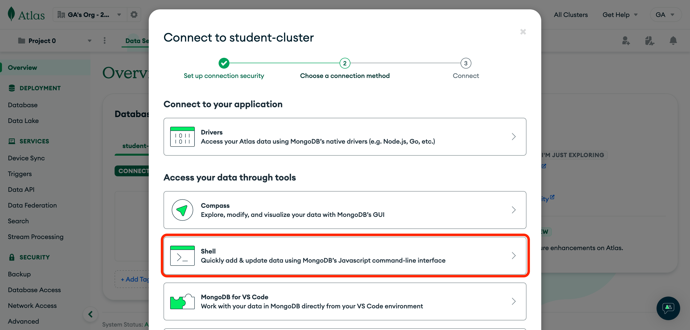
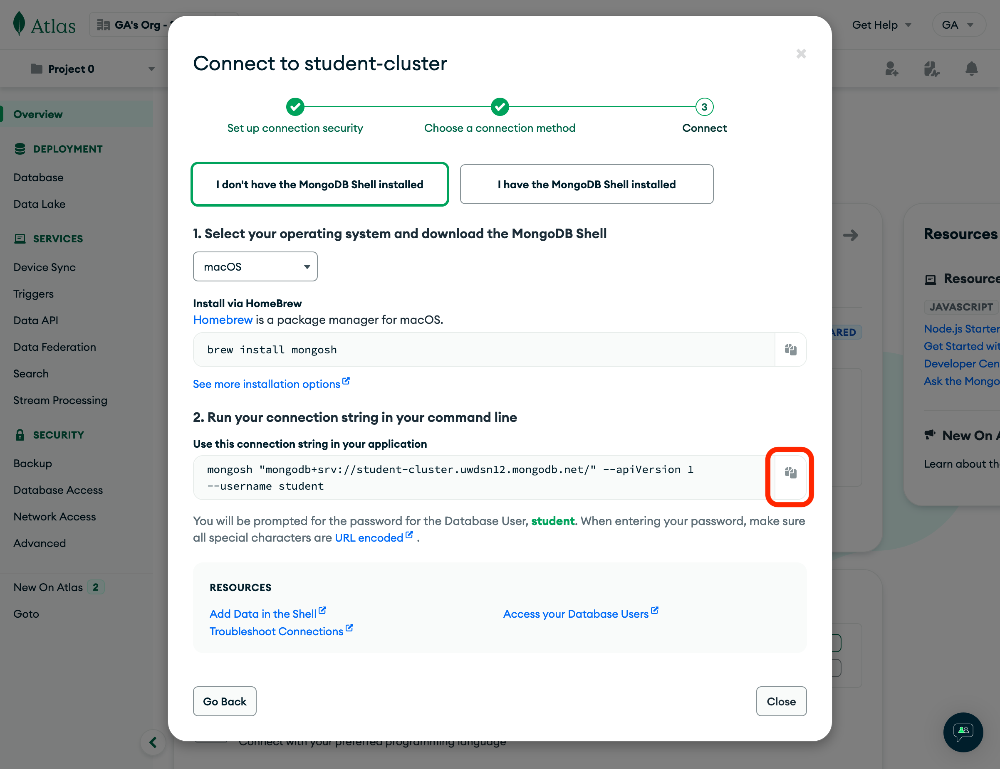

<h1>
  <span class="headline">MongoDB Atlas Setup Lab</span>
  <span class="subhead">README</span>
</h1>

## Test Drive in the Mongo Shell

Click the **Connect** button again on the **Overview** page, and this time select **Shell** under the **Access your data through tools** header:



Although Atlas may show how to install `mongosh` (MongoDB's Shell) permanently for your operating system, it is unnecessary.

Instead, we can temporarily install and run `mongosh` by copying and pasting the command shown in Atlas into your terminal.



> ❗️ Before pressing enter, add `npx` to the front of the command so that the command looks something like this:

```bash
npx mongosh "mongodb+srv://student-cluster.uwdsn12.mongodb.net/" --apiVersion 1 --username <yourusername>
```

If prompted to install, be sure to answer with `y`.

You will be prompted to enter your **_database user's_** password.

Congrats, you are now ready to test your databases! 🎉
�
