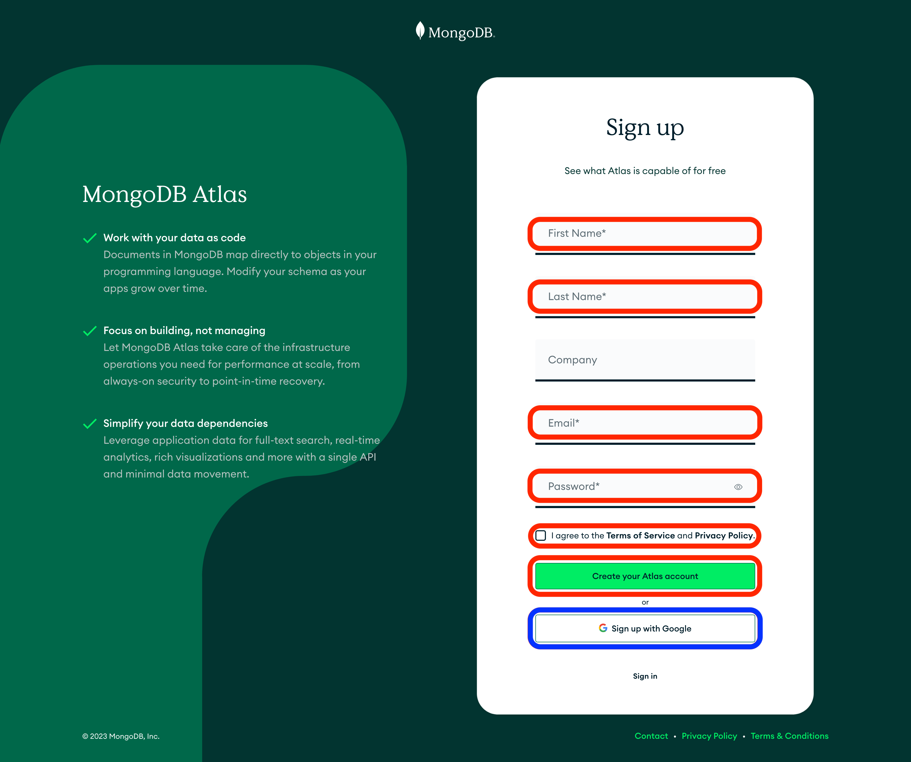

# ![[MongoDB Atlas Setup Lab] - Setup](./assets/hero.png)

tktk Write setup steps specific to the lab.

## Create an Atlas Account

The most popular service for hosting MongoDB databases, not surprisingly, is MongoDB's own [Atlas](https://www.mongodb.com/atlas/database). We'll use it to host all of our MongoDB databases in class.

First, you will need to sign up for a free account [here](https://www.mongodb.com/cloud/atlas/register).

If you want to create an account without using Sign up with Google:

1. Provide the required information. You should store this username and password somewhere easily accessible and secure (like a password manager).
2. Read the Terms of Service and Privacy Policy, then agree to them.
3. Finally select the Create your Atlas acount option.
If instead you would like to use Sign up with Google, select the Sign up with Google button.

### If You ***Did Not*** Sign Up with Google

> *If you used Sign up with Google, skip to the next section.*

If you created an account without using Sign up with Google, you'll be taken to a page asking you to verify your email, as shown below.

Find the email from MongoDB in your inbox and verify your email. After you've verified your email, you'll be taken to a page informing you that you've successfully verified your email and a **Continue** button.

Click the **Continue** button.

Skip to the **Welcome to Atlas** section below.

### If You ***Did*** Sign Up with Google

Read the Terms of Service and Privacy Policy, then agree to them.

Select the **Submit** button.

